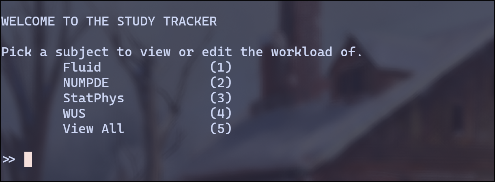
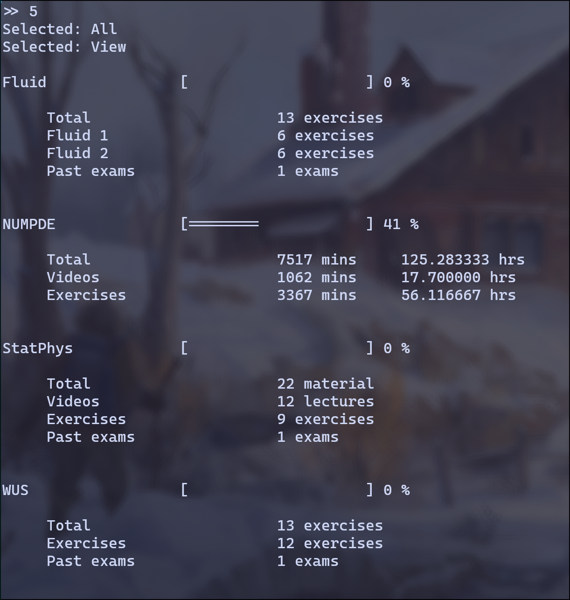
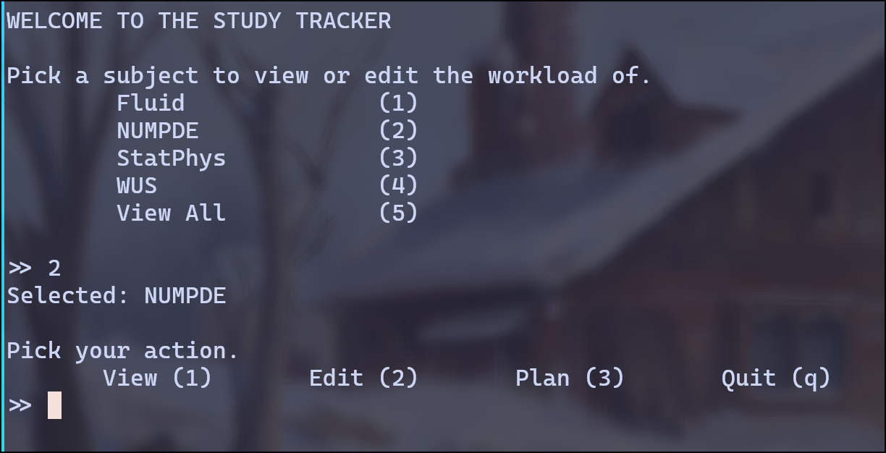
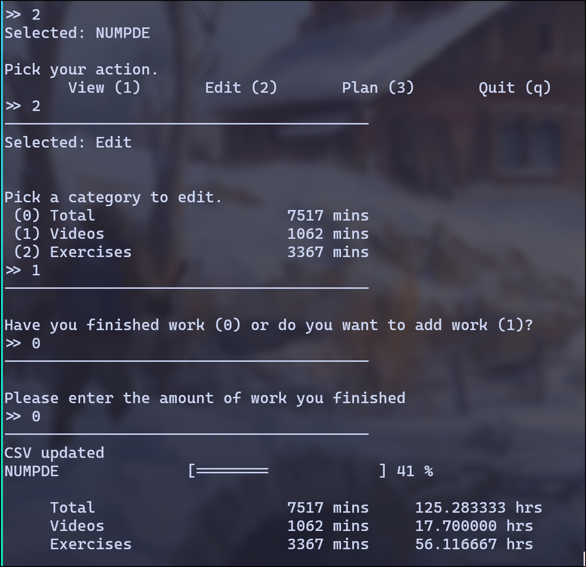
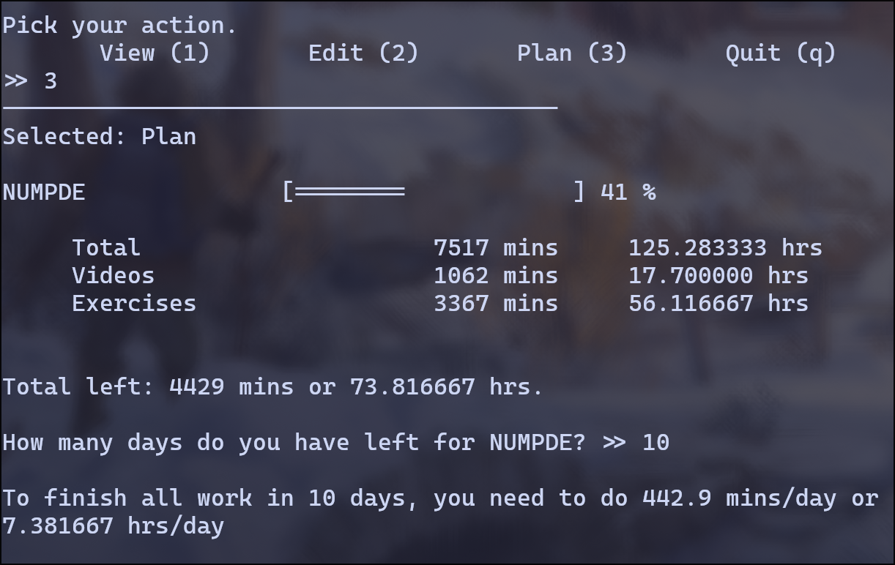

# *Study Hours*  

Study Hours is a progress tracker for a better learning experience



You can see your progress and track it very easily. The total parameter tells you how much work in total there is. The other parameters tell you how much work you still have to do.



There are different actions you can do with this tracker.




You can edit the parameters after you have finished some work, or when you want to add work.



You can also plan, to see how much work you need to do per day of a certain subject



Enjoy :)


## How to use
Clone the git repo, then go into the directory. 

#### Linux terminal
If you have a Linux terminal, you can run the shell script `setup.sh <optional_custom_dir_name>`, follow the instructions of the script. Afterward the setup phase you can run the `run_tracker.sh` script for the tracker itself, or you can always visit the `build` directory and run the executable.

```
git clone https://github.com/damcha02/study_hours.git

cd study_hours

./setup.sh <optional_custom_dir_name>

./run_tracker.sh
```

if for some reason the .sh files don't have permission to execute, just do
``` 
chmod 755 <file.sh>
```

#### Windows or Mac terminal
If you have a windows or mac terminal, then good luck, I hope it works. 
- Create a build directory
- in the build directory run cmake
- then run make
- then you should have two executable files `setup` and `tracker`
- run `setup` (you can add  a new name for the parent directory at the end) `<dir>`
- run `tracker`

```
mkdir build
cd build
cmake ..
make
./setup <dir>
./tracker
```


## Data
You can always edit your data in the `data` directory. Be careful to match the metadata entries to the data entries in the `.metadata.txt` and `data.csv` files.
